# AuraPC - Entity Relationship Diagram (ERD)

## Mermaid ERD

```mermaid
erDiagram

    %% ══════════════════════════════════════════════
    %% CORE ENTITIES
    %% ══════════════════════════════════════════════

    User {
        ObjectId _id PK
        String email UK "Optional"
        String phoneNumber UK "Required"
        String username "Optional"
        Object profile "fullName, dateOfBirth, gender"
        Array addresses "Embedded addressSchema[]"
        String avatar "Optional"
        Boolean active "Default: true"
        Date lastLogin
        Array followers "ObjectId[] → User"
        Array following "ObjectId[] → User"
        Number followerCount "Default: 0"
        Number followingCount "Default: 0"
        Array hubPosts "ObjectId[] → Post"
        Array hubReposts "ObjectId[] → Post"
        Date createdAt
        Date updatedAt
    }

    Admin {
        ObjectId _id PK
        String email UK "Required, lowercase"
        String password "Required, bcrypt"
        String name "Default: Admin"
        String role "Default: admin"
        String avatar "Optional"
        Date lastLogin
        Date createdAt
        Date updatedAt
    }

    %% ══════════════════════════════════════════════
    %% PRODUCT & CATEGORY
    %% ══════════════════════════════════════════════

    Product {
        ObjectId _id PK
        String name "Required"
        String slug UK "Required"
        String description
        String shortDescription
        String description_html
        Number price "Required"
        Number salePrice "Optional"
        Number old_price "Optional"
        Mixed category "Legacy"
        String category_id
        Array category_ids "String[]"
        Number primaryCategoryId
        Array categoryIds "Number[]"
        Mixed images
        Mixed specs "Default: {}"
        Mixed techSpecs "Default: {}"
        String brand
        Number stock "Default: 0"
        Boolean featured "Default: false"
        Boolean active "Default: true"
        Number warrantyMonths "Default: 24"
        Date createdAt
        Date updatedAt
    }

    Category {
        Mixed _id PK "Number or ObjectId"
        String category_id
        String name "Required"
        String slug UK "Required"
        String url
        String source_url
        Mixed parent_id FK "Self-ref → Category"
        Number level "Default: 0"
        Number product_count "Default: 0"
        Array product_ids "Mixed[]"
        String description
        String image
        Boolean is_active "Default: true"
        Number display_order "Default: 0"
        Mixed meta "Default: {}"
        Date createdAt
        Date updatedAt
    }

    ProductReview {
        ObjectId _id PK
        ObjectId product FK "→ Product, Required"
        ObjectId user FK "→ User, Required"
        String type "review | comment"
        Number rating "1-5, only for review"
        String content "Required"
        Array images "String[]"
        ObjectId parent FK "→ ProductReview, Optional"
        Date createdAt
        Date updatedAt
    }

    %% ══════════════════════════════════════════════
    %% ORDER & PAYMENT
    %% ══════════════════════════════════════════════

    Order {
        ObjectId _id PK
        String orderNumber UK "Required"
        ObjectId user FK "→ User, Optional"
        Array items "Embedded orderItemSchema[]"
        Object shippingAddress "fullName, phone, email, address, city, district, ward, note"
        String status "pending|confirmed|processing|shipped|delivered|cancelled"
        Number total "Required"
        Number shippingFee "Default: 0"
        Number discount "Default: 0"
        Object appliedPromotion "code, discountPercent, discountAmount"
        String paymentMethod "cod|qr|momo|zalopay|atm"
        Boolean isPaid "Default: false"
        Date paidAt
        String zaloPayTransId
        Date shippedAt
        Date deliveredAt
        Date cancelledAt
        Object cancelRequest "Embedded requestStateSchema"
        Object returnRequest "Embedded requestStateSchema"
        Date createdAt
        Date updatedAt
    }

    Promotion {
        ObjectId _id PK
        String code UK "Required, uppercase"
        String description
        Number discountPercent "Required, 1-100"
        Number maxDiscountAmount
        Number minOrderAmount "Default: 0"
        Number maxUsage
        Number usedCount "Default: 0"
        Number maxUsagePerUser "Default: 1"
        Date startDate "Required"
        Date endDate "Required"
        Boolean isActive "Default: true"
        Date createdAt
        Date updatedAt
    }

    PromotionUsage {
        ObjectId _id PK
        ObjectId promotion FK "→ Promotion, Required"
        ObjectId user FK "→ User, Required"
        ObjectId order FK "→ Order, Optional"
        Date usedAt "Default: now"
    }

    %% ══════════════════════════════════════════════
    %% CART & BUILDER
    %% ══════════════════════════════════════════════

    Cart {
        ObjectId _id PK
        ObjectId user FK "→ User, Required, Unique"
        Array items "product (→ Product), quantity"
        Date createdAt
        Date updatedAt
    }

    Builder {
        ObjectId _id PK
        String shareId UK "Auto-generated, sparse"
        ObjectId user FK "→ User, Optional"
        Mixed components "Default: {}"
        String auraVisualImage
        Date createdAt "TTL: 7 days"
        Date updatedAt
    }

    %% ══════════════════════════════════════════════
    %% BLOG & CMS
    %% ══════════════════════════════════════════════

    Blog {
        ObjectId _id PK
        String title "Required"
        String slug UK "Required"
        String excerpt
        String content
        String coverImage
        String author "Default: AuraPC"
        Boolean published "Default: false"
        Date publishedAt
        Date createdAt
        Date updatedAt
    }

    Faq {
        ObjectId _id PK
        String question "Required"
        String answer "Required"
        String category "chung|don-hang|thanh-toan|bao-hanh|khac"
        Number order "Default: 0"
        Date createdAt
        Date updatedAt
    }

    %% ══════════════════════════════════════════════
    %% AURA HUB (COMMUNITY)
    %% ══════════════════════════════════════════════

    Post {
        ObjectId _id PK
        ObjectId author FK "→ User, Required"
        String content
        Array images "String[]"
        String topic
        String status "pending|approved|rejected"
        ObjectId reviewedBy FK "→ Admin, Optional"
        Date reviewedAt
        String rejectedReason
        Array likes "ObjectId[] → User"
        Number likeCount "Default: 0"
        Number commentCount "Default: 0"
        Number shareCount "Default: 0"
        Number repostCount "Default: 0"
        Number viewCount "Default: 0"
        Boolean isRepost "Default: false"
        ObjectId originalPost FK "→ Post (self-ref)"
        ObjectId repostedBy FK "→ User, Optional"
        Object poll "Embedded: options[], endsAt, totalVotes"
        String replyOption "anyone|followers|mentioned"
        Date scheduledAt
        Boolean isPublished "Default: true"
        Date createdAt
        Date updatedAt
    }

    HubComment {
        ObjectId _id PK
        ObjectId post FK "→ Post, Required"
        ObjectId author FK "→ User, Required"
        String content "Required"
        Array images "String[]"
        Array likes "ObjectId[] → User"
        Number likeCount "Default: 0"
        ObjectId parentComment FK "→ HubComment (self-ref)"
        Number replyCount "Default: 0"
        Date createdAt
        Date updatedAt
    }

    Share {
        ObjectId _id PK
        ObjectId post FK "→ Post, Required"
        ObjectId user FK "→ User, Required"
        String method "copy_link|copy_image|embed"
        Date createdAt
        Date updatedAt
    }

    %% ══════════════════════════════════════════════
    %% AUTH
    %% ══════════════════════════════════════════════

    Otp {
        ObjectId _id PK
        String phoneNumber UK "Required"
        String code "Required"
        Number attempts "Default: 0"
        Date lockedUntil
        Date createdAt "TTL: 5 minutes"
    }

    %% ══════════════════════════════════════════════
    %% NOTIFICATIONS
    %% ══════════════════════════════════════════════

    AdminNotification {
        ObjectId _id PK
        String type "order_new|order_cancel_request|order_return_request|order_delivered"
        ObjectId order FK "→ Order, Required"
        String orderNumber "Required"
        String title "Required"
        String message "Required"
        Mixed metadata "Default: {}"
        Array readBy "ObjectId[] → Admin"
        Date createdAt
        Date updatedAt
    }

    UserNotification {
        ObjectId _id PK
        ObjectId user FK "→ User, Required"
        String type "order_confirmed|order_processing|order_shipped|..."
        String title "Required"
        String message "Required"
        Mixed metadata "Default: {}"
        Date readAt
        Date createdAt
        Date updatedAt
    }

    %% ══════════════════════════════════════════════
    %% SUPPORT / CHAT
    %% ══════════════════════════════════════════════

    SupportConversation {
        ObjectId _id PK
        ObjectId user FK "→ User, Required, Unique"
        ObjectId assignedAdmin FK "→ Admin, Optional"
        Boolean archived "Default: false"
        String lastMessagePreview
        String lastMessageBy "user|admin"
        Date lastMessageAt
        Number unreadForAdmin "Default: 0"
        Number unreadForUser "Default: 0"
        Date createdAt
        Date updatedAt
    }

    SupportMessage {
        ObjectId _id PK
        ObjectId conversation FK "→ SupportConversation, Required"
        String senderType "user|admin"
        ObjectId senderUser FK "→ User, Optional"
        ObjectId senderAdmin FK "→ Admin, Optional"
        String content "Required, max 2000"
        Date createdAt
        Date updatedAt
    }

    %% ══════════════════════════════════════════════
    %% RELATIONSHIPS
    %% ══════════════════════════════════════════════

    %% User relationships
    User ||--o{ Order : "places"
    User ||--o| Cart : "has"
    User ||--o{ ProductReview : "writes"
    User ||--o{ Builder : "creates"
    User ||--o{ Post : "publishes"
    User ||--o{ HubComment : "comments"
    User ||--o{ Share : "shares"
    User ||--o{ PromotionUsage : "uses"
    User ||--o{ UserNotification : "receives"
    User ||--o| SupportConversation : "opens"
    User ||--o{ SupportMessage : "sends"
    User }o--o{ User : "follows"

    %% Product relationships
    Product ||--o{ ProductReview : "has"
    Product }o--o{ Cart : "in cart"
    Product }o--o{ Order : "ordered in"

    %% Category self-ref
    Category ||--o{ Category : "parent of"

    %% Order relationships
    Order ||--o{ AdminNotification : "triggers"
    Order ||--o{ PromotionUsage : "applied to"

    %% Promotion
    Promotion ||--o{ PromotionUsage : "used in"

    %% Post & Hub
    Post ||--o{ HubComment : "has"
    Post ||--o{ Share : "shared via"
    Post ||--o| Post : "repost of"

    %% Review self-ref
    ProductReview ||--o{ ProductReview : "replies to"

    %% Comment self-ref
    HubComment ||--o{ HubComment : "replies to"

    %% Admin relationships
    Admin ||--o{ AdminNotification : "reads"
    Admin ||--o| SupportConversation : "assigned to"
    Admin ||--o{ SupportMessage : "replies"
    Admin ||--o{ Post : "reviews"
    Admin ||--o{ Order : "resolves requests"

    %% Support
    SupportConversation ||--o{ SupportMessage : "contains"

    %% OTP → User (by phoneNumber, not FK)
    Otp }o--|| User : "verifies (phoneNumber)"
```

## Tóm tắt quan hệ

### Quan hệ chính (Foreign Key References)

| Từ | Đến | Kiểu | Mô tả |
|-----|------|------|--------|
| Order.user | User | N:1 | Khách đặt hàng |
| Order.items[].product | Product | N:N | Sản phẩm trong đơn |
| Order.cancelRequest.resolvedBy | Admin | N:1 | Admin xử lý yêu cầu hủy |
| Order.returnRequest.resolvedBy | Admin | N:1 | Admin xử lý yêu cầu trả hàng |
| Cart.user | User | 1:1 | Giỏ hàng của user |
| Cart.items[].product | Product | N:N | Sản phẩm trong giỏ |
| ProductReview.product | Product | N:1 | Đánh giá sản phẩm |
| ProductReview.user | User | N:1 | Người đánh giá |
| ProductReview.parent | ProductReview | N:1 | Trả lời đánh giá (self-ref) |
| Builder.user | User | N:1 | Cấu hình PC của user |
| Post.author | User | N:1 | Tác giả bài đăng Hub |
| Post.originalPost | Post | N:1 | Repost (self-ref) |
| Post.reviewedBy | Admin | N:1 | Admin duyệt bài |
| HubComment.post | Post | N:1 | Bình luận bài đăng |
| HubComment.author | User | N:1 | Người bình luận |
| HubComment.parentComment | HubComment | N:1 | Trả lời bình luận (self-ref) |
| Share.post | Post | N:1 | Chia sẻ bài đăng |
| Share.user | User | N:1 | Người chia sẻ |
| Promotion → PromotionUsage | Promotion | 1:N | Lượt sử dụng mã |
| PromotionUsage.user | User | N:1 | User dùng mã |
| PromotionUsage.order | Order | N:1 | Đơn hàng áp dụng mã |
| AdminNotification.order | Order | N:1 | Thông báo đơn hàng |
| UserNotification.user | User | N:1 | Thông báo cho user |
| SupportConversation.user | User | 1:1 | Cuộc hội thoại hỗ trợ |
| SupportConversation.assignedAdmin | Admin | N:1 | Admin phụ trách |
| SupportMessage.conversation | SupportConversation | N:1 | Tin nhắn trong cuộc hội thoại |
| SupportMessage.senderUser | User | N:1 | User gửi tin nhắn |
| SupportMessage.senderAdmin | Admin | N:1 | Admin gửi tin nhắn |
| Category.parent_id | Category | N:1 | Danh mục cha (self-ref) |
| User.followers / following | User | N:N | Quan hệ theo dõi (self-ref) |

### Embedded Subdocuments (Không có collection riêng)

| Model | Subdocument | Mô tả |
|-------|-------------|--------|
| User | addresses[] | Danh sách địa chỉ nhận hàng |
| Order | items[] | Sản phẩm trong đơn (product, name, price, qty, serialNumber) |
| Order | shippingAddress | Địa chỉ giao hàng |
| Order | cancelRequest / returnRequest | Yêu cầu hủy/trả hàng (status, reason, resolvedBy) |
| Order | appliedPromotion | Mã giảm giá đã áp dụng |
| Post | poll.options[] | Các lựa chọn bình chọn |

### Thống kê

- **Tổng số entities**: 20
- **Entities có timestamps**: 18 (trừ Otp, PromotionUsage)
- **Self-referencing**: 4 (Category, ProductReview, Post, HubComment)
- **TTL (tự xóa)**: Otp (5 phút), Builder (7 ngày)
